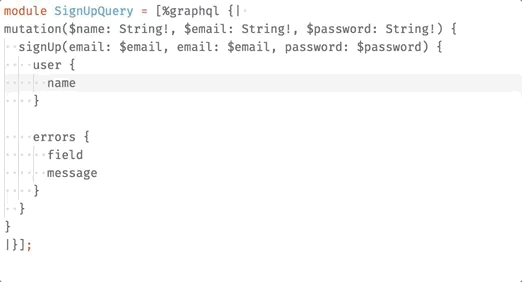
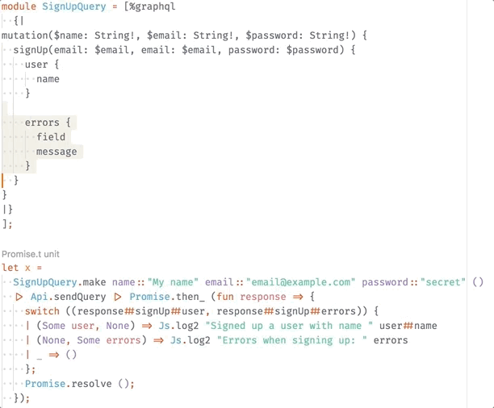

# GraphQL syntax extension for Bucklescript/ReasonML

> *Work in progress:* only a small subset of GraphQL is implemented and there
> are probably a lot of bugs.

This library lets you construct type-safe and validated queries at compile time,
and generates response validation code for you. If you're writing a
[Bucklescript](https://bucklescript.github.io/bucklescript/Manual.html) app that
talks to a [GraphQL](http://graphql.org) server, this library will cut down on
the boilerplate you have to write.

It is compatible with both OCaml and ReasonML syntax. There are no runtime
dependencies except for `Js.Json` and `Js.Dict`, both included in the
Bucklescript standard library.

## Installation

Assuming that you've already got a Bucklescript project set up, installing this
PPX consists of three steps:

First, install the [OPAM](https://opam.ocaml.org) package to download and build
the transform itself:

```sh
opam install graphql_ppx
```

Next, add this package as a dependency to your `package.json`:

```sh
yarn add --dev graphql_ppx
# or, if you use npm:
npm install --saveDev graphql_ppx
```

Finally, add the PPX to your `bsconfig.json`:

```json
{
    "ppx_flags": [
        "graphql_ppx/ppx"
    ]
}
```

**Note**: If you want to use this, make sure to read the limitations at the
bottom of this readme first!

## Examples

If you add a field that does not exist, you'll get a compiler error on the exact
location this happens. This automatically works with
[Merlin](https://github.com/ocaml/merlin), giving you immediate feedback in your
editor:



Variables sent to queries and mutations are of course typed too. Nullable
variables are translated to optional labelled arguments, while non-null
variables become mandatory arguments:


(The `Api.sendQuery` function here is a small wrapper around [bs-fetch](https://github.com/reasonml-community/bs-fetch), check it out below)

The result of a query is turned into a typed `Js.t` object, which will generate compiler errors if you try to access fields that don't exist:



While these examples use the [ReasonML](https://reasonml.github.io) syntax,
using the standard OCaml syntax works as well.

## Usage

### Download the server schema

This plugin requires a `graphql_schema.json` file to exist somewhere in the
project hierarchy, containing the result of sending an [introspection
query](https://github.com/graphql/graphql-js/blob/master/src/utilities/introspectionQuery.js)
to your backend.

To help you with this, a simple script is included to send this query to a
server and save the result as `graphql_schema.json` in the current directory.

```sh
yarn send-introspection-query http://my-api.example.com/api
# or, if you use npm
npm run send-introspection-query http://my-api.example.com/api
```

### Send queries

To define a query, you declare a new module and type the query as a string
inside the `graphql` extension:

```reason
module HeroQuery = [%graphql {|
{
  hero {
    name
  }
}
|}];
```

This module exposes a few functions, but the most useful one is `make`, which
takes all arguments to the query/mutation as labelled function arguments, ending
with `()`. It an object containing three things: `query`, which is a string
containing the query itself; `variables`, a `Js.Json.t` object containing the
serialized variables for the query; and `parse`, a function that takes a
`Js.Json.t` instance and returns a typed object corresponding to the query.

A simple example might make this a bit clear:

```reason
module HeroQuery = [%graphql {| { hero { name } } |}];

/* Construct a "packaged" query; HeroQuery takes no arguments: */
let heroQuery = HeroQuery.make ();

/* Send this query string to the server */
let query = heroQuery##query;

/* Let's assume that this was the result we got back from the server
let sampleResponse = "{ \"hero\": {\"name\": \"R2-D2\"} }";

/* Convert the response to JSON and parse the result */
let result = Js.Json.parseExn sampleResponse |> query##parse;

/* Now you've got a well-typed object! */
Js.log ("The hero of the story is " ^ result##hero##name);
```

### Integrating with the Fetch API

[bs-fetch](https://github.com/reasonml-community/bs-fetch) is a wrapper around
the Fetch API. I've been using this simple function to send/parse queries:

```reason
exception Graphql_error string;

let sendQuery q =>
  Bs_fetch.(
    fetchWithInit
      "https://my-api.example.com/api"
      (
        RequestInit.make
          method_::Post
          body::(
            Js.Dict.fromList [("query", Js.Json.string q##query), ("variables", q##variables)] |> Js.Json.object_ |> Js.Json.stringify |> BodyInit.make
          )
          credentials::Include
          headers::(HeadersInit.makeWithArray [|("content-type", "application/json")|])
          ()
      ) |>
    Js.Promise.then_ (
      fun resp =>
        if (Response.ok resp) {
          Response.json resp |>
          Js.Promise.then_ (
            fun data =>
              switch (Js.Json.decodeObject data) {
              | Some obj => Js.Dict.unsafeGet obj "data" |> q##parse |> Js.Promise.resolve
              | None => Js.Promise.reject @@ Graphql_error "Response is not an object"
              }
          )
        } else {
          Js.Promise.reject @@ Graphql_error ("Request failed: " ^ Response.statusText resp)
        }
    )
  );
```

# Limitations

This implementation is very incomplete. It does *not* support:

* Arguments with input objects (only scalars, lists, and enums work)
* Fragments of any kind. This means that interfaces and unions are unusable in
  practice.
* All GraphQL validations. It will *not* validate argument types and do other
  sanity-checking of the queries. The fact that a query compiles does not mean
  that it will pass server-side validation.

# Things that *do* work

* Objects are converted into `Js.t` objects
* Enums are converted into [polymorphic
  variants](https://realworldocaml.org/v1/en/html/variants.html)
* Floats, ints, strings, booleans are converted into their corresponding native
  OCaml types.

## Extra features

If you've got an object which in practice behave like a variant - like `signUp`
above, where you *either* get a user *or* a list of errors - you can add a
`@bsVariant` directive to the field to turn it into a polymorphic variant:

```reason
module SignUpQuery = [%graphql
  {|
mutation($name: String!, $email: String!, $password: String!) {
  signUp(email: $email, email: $email, password: $password) @bsVariant {
    user {
      name
    }

    errors {
      field
      message
    }
  }
}
|}
];

let x =
  SignUpQuery.make name::"My name" email::"email@example.com" password::"secret" ()
  |> Api.sendQuery |> Promise.then_ (fun response => {
    switch (response##signUp) {
    | `User user => Js.log2 "Signed up a user with name " user##name
    | `Errors errors => Js.log2 "Errors when signing up: " errors
    };
    Promise.resolve ();
  });
```

This helps with the fairly common pattern for mutations that can fail with
user-readable errors.

The `@bsVariant` directive is removed from the query at compile-time, so your
server don't have to support it.

## Future work

Core GraphQL features that need to be implemented:

- [ ] Inline fragments
- [ ] Fragment spreads
- [ ] Selecting on interfaces
- [ ] Selecting on unions
- [ ] Input object arguments
- [ ] The query validations

Nice-to-have features:

- Using external records instead of objects, useful if you've already defined a
  record that you want to use in the rest of the codebase:
  ```graphql
  {
    hero @bsRecord(name: "Model.hero") {
      name
      homePlanet
    }
  }
  ```

  The same could probably be built for GraphQL enums.